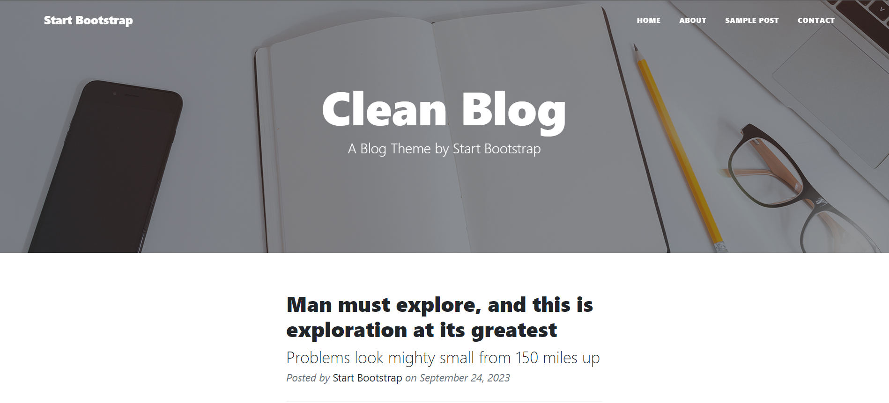
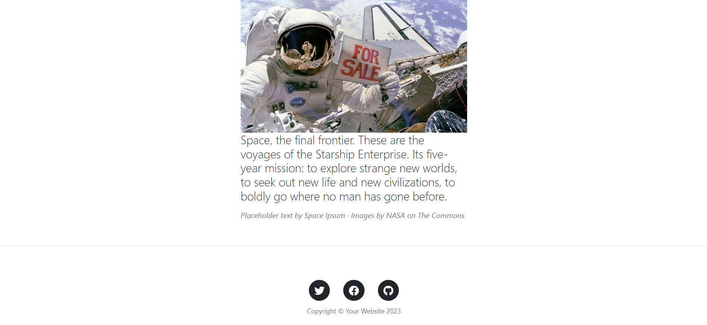

# Clean Blog

Clean Blog is a blog theme designed by Start Bootstrap.

## Overview

Clean Blog is an elegant blog theme with a simple design. The page mainly consists of a header bar at the top and a few articles below it. Additionally, social media links and copyright information are located at the bottom of the page.

## Features

- The header bar contains the "Start Bootstrap" logo and menu links that direct to the home page and other pages.
- The top section of the page includes a large title, a subtitle, and a preview of an article.
- Each article includes the publishing date and the information that it was posted by "Start Bootstrap."
- At the bottom of the page, there are social media links and copyright information.
- A button labeled "Older Post" is located at the bottom of the page.

## Sample Images

## Demo

 [Live](https://unaygney.github.io/tech-careeer-task/sample.html)

## Resources

- Start Bootstrap: [https://startbootstrap.com/](https://startbootstrap.com/previews/clean-blog)

## Author

- Email: [gneyunay@gmail.com](mailto:gneyunay@gmail.com)

